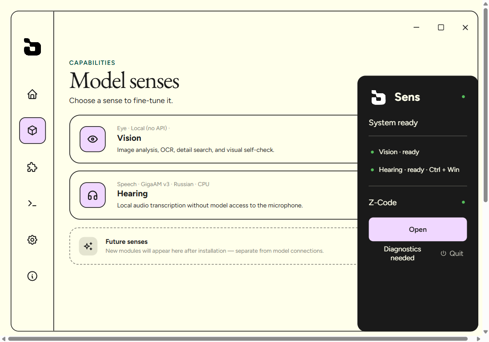

<div align="center">


# Sens

**A local capability layer for language models.** Vision and hearing for text-only models — on your machine, no cloud, no API keys, no per-image cost.

[](https://github.com/TheRofli/Sens/releases)
[](#requirements)
[](#license)
[](#connect-a-model)

</div>

---

## What is Sens?

Sens gives text-first models two senses they don't have:

- **👁️ Vision (Sight)** — a fully local, deterministic perception stack: OCR, layout blocks, object detection, scene classification, attention maps, and cross-layer verification. Runs on your CPU. **Zero API calls, zero tokens, zero cost.**
- **👂 Hearing** — push-to-talk dictation and side-effect-free audio file transcription with local models (Whisper RU, Parakeet, GigaAM v3). The model never touches your microphone.

One Rust broker owns both, one MCP connection exposes them, one tray app controls them. The desktop UI ships in **English and Russian** (Settings → Interface language).


## Why local?

| | Sens | Cloud vision API |
|---|---|---|
| Cost per image | **$0** | per-request billing |
| Privacy | image never leaves the machine | sent to a third party |
| Speed (warm) | **~1 s** | 5–15 s + network |
| Determinism | same image → same dump | model-dependent |
| API keys | none | required |

## Features

### 👁️ Sight — local deterministic vision

- **6 analysis layers**: palette (k-means) → OCR (RapidOCR, cyrillic + latin) → layout blocks (OpenCV) → objects + scene (YOLOv8n + CLIP ViT-B-32) → attention map → **cross-layer verification** that reconciles layers and reports conflicts
- **Grounding**: `sens_locate` finds a text target and returns its exact pixel box; `sens_inspect` zooms into a region or a located target with an upscaled crop (Zoom-Refine style)
- **Content-addressed caching**: same file → same dump in ~10 ms (sha256 + region key, 7-day TTL)
- Always maximum quality — no modes to configure

### 👂 Hearing — dictation & transcription

- Push-to-talk with a global hotkey (Ctrl+Win) that types into the active field
- Local models: **Whisper RU** (RU+EN code-switching), Parakeet (fast), GigaAM v3 (Russian, punctuation)
- Audio/video files with timestamped segments; video stills via `frames` / `every` / `at`
- YouTube links via `sens_fetch` — downloaded locally, cached by video ID

### 🚀 Releases & updates

- Signed installers built automatically by GitHub Actions on every `v*` tag
- In-app updater: Settings → Check for updates

## Screenshots

| Capabilities | Sight settings |
|---|---|
|  |  |

## Connect a model

Any MCP-compatible host can launch `sens-mcp` over stdio:

```powershell
$env:SENS_SPEECH_ROOT = 'D:\Speech'          # local python env + models
sens-mcp.exe                                  # stdio MCP server
```

For Z-Code, use the reversible connector:

```powershell
sens-connect.exe zcode install `
  C:\Users\kanal\.zcode\cli\config.json `
  D:\Sens\target\release\sens-mcp.exe
```

Restart Z-Code after installation. To undo only the Sens changes:

```powershell
sens-connect.exe zcode uninstall
```

The connector preserves unrelated settings and creates a timestamped backup.

## How it works

```
┌────────────────────────────────────────────────────────────┐
│  Host model (e.g. DeepSeek)                                 │
│    "what does this screenshot say?"                         │
└──────────────────────────┬─────────────────────────────────┘
                           │ MCP tools: sens_see / sens_read /
                           │ sens_locate / sens_inspect / sens_hear
┌──────────────────────────▼─────────────────────────────────┐
│  sens-mcp (Rust, stdio MCP server)                          │
└──────────────────────────┬─────────────────────────────────┘
                           │ named pipe  \\.\pipe\sens-broker-v1
┌──────────────────────────▼─────────────────────────────────┐
│  sens-broker (Rust, single owner)                           │
│    routes: see/read/locate/inspect → local Python worker    │
│            compare/artifact_get → optional cloud Eye        │
└──────────────────────────┬─────────────────────────────────┘
                           │ NDJSON over stdin/stdout
┌──────────────────────────▼─────────────────────────────────┐
│  sight-worker.py (CPU only)                                 │
│   L0 colors → L1 OCR → L2 layout → L3 objects+scene →       │
│   L4 attention → L5 cross-layer verification → JSON dump    │
└─────────────────────────────────────────────────────────────┘
```

The model never sees pixels — it reads a structured, deterministic dump and reasons over it. Perception is free and local; reasoning stays with the model.

### Components

| Crate / app | Role |
|---|---|
| `sens-protocol` | versioned contracts, capability registry, envelope |
| `sens-core` | state, policy, execution |
| `sens-broker` | named-pipe runtime, lazy worker supervisor, capability owner |
| `sens-mcp` | stdio MCP server, 15+ tools |
| `sens-connect` | reversible connector setup for Z-Code |
| `sens-desktop` | Tauri tray + settings UI (RU/EN) |
| `sidecars/` | `sight-worker.py`, `hearing-worker.py`, `eye-worker.mjs` |

## Requirements

| Resource | Sens 1.2 |
|---|---|
| OS | Windows 10/11 x64 |
| RAM, app idle | ~0.5 GB (incl. UI engine) |
| RAM, after first vision call | +1.3 GB (local neural stack, lazy-loaded once) |
| CPU | 0% idle; ~1 s full-core burst per analysis |
| Disk | 20 MB app + ~625 MB vision models |
| Python env (shared with Hearing) | ~2.3 GB (torch, whisper, gigaam) |

No GPU required, no internet required for vision and hearing.

## Build & verify

```powershell
cargo fmt --all -- --check
cargo test --workspace
cargo clippy --workspace --all-targets -- -D warnings

Set-Location apps\desktop-ui
npm install
npm run build
npm run native:build
```

The native build emits both installers:

- `target\release\bundle\nsis\Sens_<version>_x64-setup.exe`
- `target\release\bundle\msi\Sens_<version>_x64_ru-RU.msi`

## Releasing

1. Bump the version in `Cargo.toml`, `apps/desktop-ui/package.json`, and `apps/desktop-ui/src-tauri/tauri.conf.json`
2. Commit, push, then tag and push:

```powershell
git tag v1.2.3
git push origin v1.2.3
```

3. The `Release` workflow builds, signs, and publishes installers + `latest.json` to a GitHub release
4. Installed apps pick it up via Settings → Check for updates

Requires two repository secrets: `TAURI_SIGNING_PRIVATE_KEY` and `TAURI_SIGNING_PRIVATE_KEY_PASSWORD`.

## Layout

```
crates/       protocol, core, broker, MCP server, connect CLI
apps/         desktop-ui (React + Vite + Tauri)
sidecars/     sight-worker.py, hearing-worker.py, eye-worker.mjs
assets/       README artwork
.github/      release pipeline
```

## License

MIT
