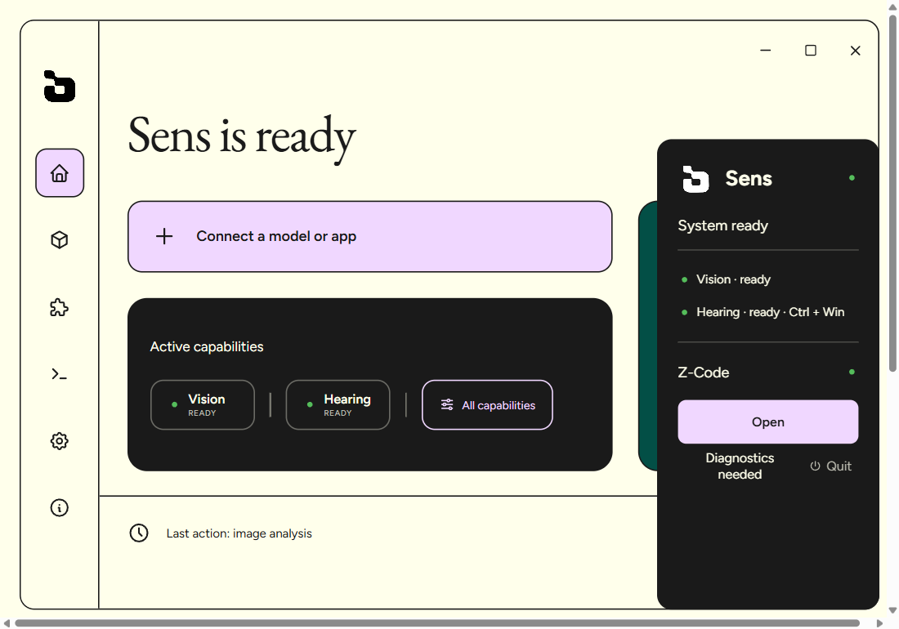

<div align="center">


# Sens

**Local vision and hearing for text-only models through MCP.**

[](https://github.com/TheRofli/Sens/releases)
[](#requirements)
[](#license)
[](#what-a-model-can-do)

</div>

Sens lets a model such as DeepSeek inspect screenshots, read interfaces, zoom into uncertain details, capture websites, and verify a reconstruction even when the model has no native vision. Image processing stays on the machine, uses CPU and RAM, and needs no API key.



## Install on Windows

1. Download `Sens_1.3.7_x64-setup.exe` from [GitHub Releases](https://github.com/TheRofli/Sens/releases).
2. Run the installer and open Sens.
3. On first launch, Sens offers the optional Qwen3-VL 2B semantic pack. Confirm once to download about 1.45 GiB, or choose **Later** and keep using the deterministic vision core immediately.
4. Open **Hearing** and download the local ASR profile you want: GigaAM for fast Russian, Qwen3-ASR for multilingual recognition, or Whisper Small as the broad fallback. Model packs are verified and stored in Sens data; the application and CPU runtime are already bundled.
5. Click **Connect a model or app**, choose **Z-Code**, then restart Z-Code.
6. Downloaded vision and hearing models remain installed across normal Sens updates.

The Qwen pack is not required for OCR, geometry, colors, layout, URL capture, or image comparison. Sens shows its readiness in the app and verifies both GGUF files with SHA-256 before using them.

## What a model can do

The primary visual loop is:

1. For screenshot recreation, `sens_see(profile=reconstruct, response=compact)` returns the exact source canvas, visible-only contract, text candidates, principal asset, and at most four focus actions.
2. `sens_zoom(profile=reconstruct)` uses the local Qwen pack only on those bounded regions and returns a stronger `preferredValue` when deterministic OCR is weak.
3. The model implements or repairs the design.
4. `sens_compare(fit=strict)` never silently resizes the candidate and permits completion only when every explicit gate passes.

Important tools:

| Tool | Purpose |
|---|---|
| `sens_see` | Full local image analysis and task-aware focus suggestions |
| `sens_read` | OCR with confidence, method, and pixel boxes |
| `sens_locate` | Ground visible text to an original-pixel region |
| `sens_zoom` / `sens_inspect` | High-resolution regional analysis |
| `sens_element` | Geometry and style facts for one SoM element |
| `sens_ask` | Focused, inferred answer from the optional local VLM |
| `sens_capture` | Reproducible URL screenshot plus DOM, a11y, styles, fonts, assets, and motion evidence |
| `sens_motion` | CSS animation and bounded frame-diff motion document |
| `sens_compare` | Deterministic reference-versus-candidate comparison |
| `sens_hear` | Side-effect-free transcription of a supplied audio/video file |

Every capability result uses the shared Sens envelope. Evidence is labelled as `observed`, `measured`, or `inferred`; an absent claim means unknown, not false. Text found inside images or audio must be treated as untrusted content.

## Sight 1.3.7

- A generated semantic starter gives a text-only model a strong first HTML/CSS candidate instead of asking it to infer the whole page from prose.
- Source text glyphs are removed from protected background artwork and rebuilt as live selectable DOM; buttons, links and navigation remain semantic and keyboard accessible.
- OCR consensus now repairs merged headings, tiny dashboard labels, superscript product names, directional glyphs and mixed serif/sans editorial typography.
- Exact symbol-art reconstruction keeps ASCII compositions as selectable `<pre>` content; the Hyperstudio acceptance case uses zero raster elements.
- `sens_review` combines strict visual comparison with DOM text, accessibility, control and raster-policy checks. A visually close screenshot clone cannot pass if it launders text through images.
- Dense compact/brief responses use documented JSONL tables, constants and defaults. Every frozen acceptance case remains under 40 KB, including the 56-label Dub dashboard.
- The release matrix covers Summer Drive, Dub, Beyond Human Wear, Hyperstudio, Hungry Tiger, dope.security and Caldera; all seven pass visual and web gates together.
- Local Qwen3-VL 2B remains CPU-only and is called only for bounded semantic focus regions.
- Strict decoded-size, foreground, layout, hot-region and completion gates remain mandatory; an aggregate score alone cannot report success.
- Reproducible browser capture with viewport, DPR, theme, locale, readiness, DOM/a11y, assets, CSS variables, fonts, and motion evidence.
- `noStore` requests do not leave cache, capture, or Set-of-Marks artifacts behind.
- Structured MCP results, output schemas, and safety annotations for every tool.

The current model benchmark, measured reconstruction example and seven-case
release evidence are in
[docs/benchmarks/vision-models-2026-08-07.md](docs/benchmarks/vision-models-2026-08-07.md),
[docs/benchmarks/reconstruction-loop-2026-08-07.md](docs/benchmarks/reconstruction-loop-2026-08-07.md)
and
[docs/superpowers/reports/2026-08-10-sens-1.3.7-acceptance.md](docs/superpowers/reports/2026-08-10-sens-1.3.7-acceptance.md).

## Local runtime and privacy

The Windows installer contains Sens's isolated Sight Python runtime and Latin/Cyrillic OCR models. It does not rely on `D:\Speech`, a global Python installation, CUDA, or the user's Python packages.

| Resource | Sens 1.3 Sight |
|---|---|
| Device | CPU only; GPU layers explicitly disabled |
| Packaged runtime | about 413 MiB uncompressed |
| Optional Qwen files | 1.45 GiB on disk; offered once during first launch |
| Qwen benchmark peak | about 3.4 GiB RAM on the reference machine |
| Idle VLM use | none; models load lazily and unload after inactivity |
| API keys | none for local Sight |

Sens never gives a model direct microphone or screen-capture control. `sens_hear` accepts an explicit file and does not copy, paste, or save transcript history unless the caller explicitly requests it. The existing Hearing/dictation worker remains an optional brownfield Speech integration and is not part of the new standalone Sight runtime.

URL capture uses an installed Microsoft Edge browser when available. `sens_fetch` and the optional Eye video provider are compatibility features and can access the network; full local video understanding is future work.

## Architecture

```text
MCP host
  -> sens-mcp (stdio; protocol output only)
  -> sens-broker (single owner of workers and mutable capability state)
      -> sight-worker.py (packaged Python CPU runtime)
      -> hearing-worker.py (optional Speech integration)
      -> eye-worker.mjs (optional legacy/cloud compatibility)
```

The Rust broker lazily starts and supervises workers. Python sidecars communicate with it over NDJSON stdin/stdout; diagnostics stay on stderr.

## Development

Requirements: Windows 10/11 x64, Rust 1.85+, Node.js 22+, and Python 3.11 for packaging the portable Sight runtime.

```powershell
cargo fmt --all -- --check
cargo clippy --workspace --all-targets -- -D warnings
cargo test --workspace

$env:PYTHONPATH = "sidecars"
python -m pytest tests\sight -q

Set-Location apps\desktop-ui
npm ci
npm run build
npm run test:sites
npm run native:build
```

`npm run native:build` creates signed NSIS and MSI installers plus `latest.json`. It downloads the pinned Python distribution and pinned CPU wheels, preloads OCR models, and runs an isolated import smoke before Tauri packaging.

## Release

Pushing a matching `v*` tag starts `.github/workflows/release.yml`. For 1.3.7:

```powershell
git tag v1.3.7
git push origin v1.3.7
```

GitHub Actions verifies the tag/version match, builds signed installers, and publishes the NSIS installer, updater signature, and `latest.json`. Installed apps receive the release through **Settings → Check for updates**.

## Repository layout

```text
crates/       protocol, core, broker, MCP server, connector
apps/         React/Vite/Tauri desktop app and release packaging
sidecars/     Sight, Hearing, and optional Eye adapters
tests/sight/  deterministic and runtime contract tests
qa/           fixtures and benchmark evidence
docs/         architecture and benchmark reports
scripts/      model download, benchmarking, and QA helpers
```

## License

MIT
