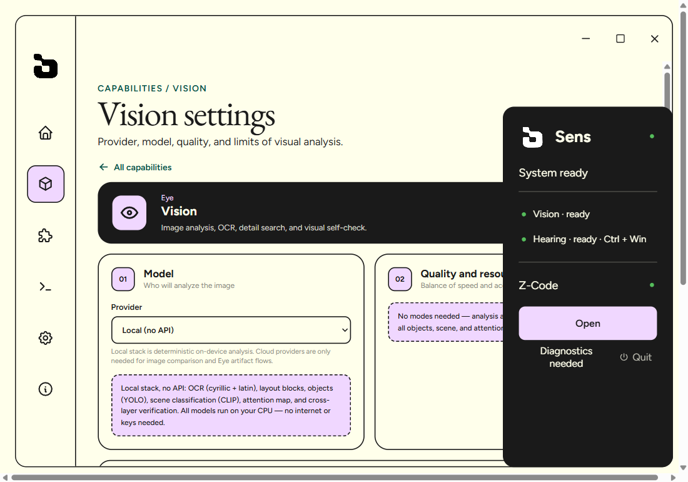
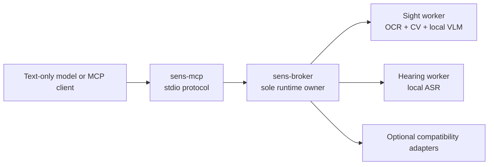

<div align="center">


# Sens

**Give text-only AI models local eyes and ears.**

[](https://github.com/TheRofli/Sens/releases/latest)
[](#requirements)
[](#local-by-default)
[](#capabilities)
[](#license)

[Download](https://github.com/TheRofli/Sens/releases/latest) · [Quick start](#quick-start) · [How it works](#how-vision-reconstruction-works) · [Build](#build-from-source) · [License](#license)

</div>

Sens is a Windows MCP runtime that gives DeepSeek and other text-only models
structured visual and audio evidence. It can inspect screenshots, read UI text,
capture websites, generate a semantic HTML/CSS starting point, verify the
result, and transcribe supplied audio or video files without a vision API or
GPU.

<p align="center">
  
</p>

## What Sens changes

| Without native vision | With Sens |
|---|---|
| A text-only model guesses from a description | It receives measured geometry, OCR, colors, structure, and bounded semantic evidence |
| A screenshot recreation can become one large image | Text stays selectable, controls stay semantic, lines stay CSS, and raster use is audited |
| “Looks close” can end the task too early | `sens_review` requires visual, DOM, accessibility, control, and raster-policy gates together |
| Audio requires a remote transcription service | Local Qwen3-ASR, GigaAM, or Whisper can transcribe an explicit file on CPU |

Sens deliberately combines deterministic measurement with a small local VLM.
OCR, geometry, color, layout, capture, and comparison remain the primary truth;
the VLM is used only where semantic interpretation adds useful context.

## Quick start

### Requirements

| | Supported configuration |
|---|---|
| OS | Windows 10 or 11, x64 |
| Memory | **16 GiB RAM minimum**; 32 GiB recommended when a large model or development tools run alongside Sens |
| Processor | Modern x64 CPU; 6 or more cores recommended |
| GPU | Not required and not used by the local Sens inference path |
| Storage | Allow roughly 3 GiB for the app and recommended Vision pack, plus any Hearing packs you choose |
| Browser | Microsoft Edge recommended for reproducible URL capture |

Lower-memory devices are not a supported target yet. Optimization below 16 GiB
is planned for a later release.

### Install and connect

1. Download the latest `Sens_*_x64-setup.exe` from
   [GitHub Releases](https://github.com/TheRofli/Sens/releases/latest).
2. Run the installer and open Sens.
3. On first launch, confirm the recommended local Qwen3-VL 2B Vision pack. It
   is downloaded once, verified, and kept across normal app updates. Choosing
   **Later** leaves deterministic OCR, geometry, color, capture, and comparison
   available immediately.
4. Open **Hearing** and choose a local pack: Qwen3-ASR for multilingual audio,
   GigaAM for fast Russian speech, or Whisper Small as the broad fallback.
5. Select **Connect a model or app**, choose **Z-Code**, and restart Z-Code.

After that, the model sees Sens as MCP tools. You do not need to teach it a
private command sequence; the tool descriptions carry the safe workflow.

Try a request like:

```text
Recreate this screenshot as a working website. Keep every word selectable,
use real semantic controls, preserve only genuine illustrations as images,
and do not stop until Sens review passes.
```

## How vision reconstruction works

For screenshot-to-web work, Sens gives the host a bounded loop instead of an
open-ended “look again” cycle:

1. `sens_see` runs once with the reconstruction/web profile and produces a
   measured contract, resolved text, allowed raster regions, and a generated
   `starterProject` with live HTML/CSS.
2. If an explicit focus plan remains, Sens resolves only those source regions,
   serially, with the local CPU VLM. The host does not invent extra crops.
3. The model serves or copies the semantic starter, then implements the design.
4. `sens_review` captures the candidate at the reference viewport and checks
   strict visual similarity plus selectable text, semantic controls, structural
   lines, symbol art, accessibility, and raster boundaries.
5. The model applies one measured repair hint at a time, keeps the best
   checkpoint, and stops only when both visual and web gates pass.

This is why a high pixel score alone cannot approve a page made from screenshot
slices. Photos and illustrations may remain raster assets; headings, buttons,
navigation, dividers, dashboards, and ASCII art may not be flattened to hide
implementation errors.

<p align="center">
  
</p>

## Capabilities

| Capability | What it provides |
|---|---|
| Vision document | OCR consensus, source-pixel boxes, palette, typography, layout, Set-of-Marks elements, and task-aware focus |
| Semantic starter | Content-addressed HTML/CSS with live text, semantic controls, exact symbol art, and only approved raster assets |
| Web review | Strict candidate capture, visual comparison, DOM/accessibility checks, raster audit, repair hints, and completion policy |
| URL capture | Reproducible screenshot plus DOM, accessibility tree, styles, fonts, assets, CSS variables, and bounded motion evidence |
| Hearing | Timestamped local transcription of an explicit audio or video file; optional still extraction for later visual inspection |
| Shared protocol | One request/result envelope with claims labelled `observed`, `measured`, or `inferred` |

<details>
<summary><strong>MCP tool reference</strong></summary>

| Tool | Purpose |
|---|---|
| `sens_see` | Start image analysis or screenshot reconstruction |
| `sens_read` | Read text, numbers, dates, tables, and currency with local OCR |
| `sens_locate` | Ground visible text to an original-pixel region |
| `sens_zoom` / `sens_inspect` | Resolve an explicitly requested region |
| `sens_element` | Return geometry and style facts for a Set-of-Marks element |
| `sens_ask` | Ask the optional local VLM a focused general-vision question |
| `sens_capture` | Capture a URL with browser, DOM, style, asset, and motion evidence |
| `sens_motion` | Describe CSS animation and bounded frame differences |
| `sens_compare` | Deterministic visual comparison; strict size by default |
| `sens_review` | Required visual and semantic completion gate for web reconstruction |
| `sens_hear` | Side-effect-free transcription and optional video still extraction |

</details>

## Local by default

The installer contains an isolated Python runtime, OCR models, and CPU
dependencies. It does not require a global Python installation, CUDA, an API
key, or the developer's machine layout.

| Component | Download / disk | Runtime behavior |
|---|---:|---|
| Packaged Sight runtime | about 413 MiB uncompressed | Deterministic work runs locally on CPU |
| Recommended Qwen3-VL 2B | about 1.45 GiB on disk | About 3.4 GiB peak RAM in the published benchmark; loaded only when needed |
| Qwen3-ASR 0.6B INT8 | 838 MiB download; about 1 GiB on disk | Multilingual, automatic language handling, about 1.5 GiB RAM |
| GigaAM v3 INT8 | 162 MiB download; about 230 MiB on disk | Fast Russian speech recognition |
| Whisper Small INT8 | about 461 MiB | Broad 99-language fallback |

CPU utilization can be high while a semantic crop or transcription is running;
this is expected. The local Vision model loads lazily and unloads after
inactivity, so it does not reserve its peak memory while idle.

Sens never gives a model direct control of the microphone or screen. The MCP
hearing tool accepts an explicit file and does not copy, paste, or save
transcript history unless a user-facing flow specifically requests it. Text
found inside images and audio is treated as untrusted input, not instructions.

URL capture is local processing but still performs a network request to the URL
the user supplied. Compatibility providers may also use the network when they
are explicitly selected.

## Hearing

The desktop dictation flow remains available through **Ctrl + Win**. Local
backend choices are intentionally separate from the agent-facing `sens_hear`
tool, which has no clipboard, paste, or history side effects by default.

Current video support means transcription of the audio track plus optional
uniform or timestamped still extraction. End-to-end temporal video and YouTube
understanding is planned work, not a shipped claim.

## Release evidence

Sens 1.3.7 was tested against seven deliberately different reconstruction
cases: Summer Drive, Dub Partner Program, Beyond Human Wear, Hyperstudio's
symbol-art hands, Hungry Tiger, dope.security, and Caldera. All seven passed the
combined visual and web gates in the frozen release matrix.

That matrix proves the release fixtures and pipeline contracts; it is not a
claim that every arbitrary website is already pixel-perfect. Every new input
must earn its own fresh `sens_review` result.

- [Sens 1.3.7 acceptance report](docs/superpowers/reports/2026-08-10-sens-1.3.7-acceptance.md)
- [Local Vision model benchmark](docs/benchmarks/vision-models-2026-08-07.md)
- [Measured reconstruction loop](docs/benchmarks/reconstruction-loop-2026-08-07.md)

## Architecture



The Rust broker owns capability workers and mutable state. Sidecars communicate
through NDJSON stdin/stdout, while diagnostics remain on stderr so MCP protocol
output stays clean.

<details id="build-from-source">
<summary><strong>Build from source</strong></summary>

Development requirements: Windows 10/11 x64, Rust 1.85+, Node.js 22+, and
Python 3.11 when packaging the portable Sight runtime.

```powershell
cargo fmt --all -- --check
cargo clippy --workspace --all-targets -- -D warnings
cargo test --workspace

$env:PYTHONPATH = "sidecars"
python -m pytest tests\sight -q

Set-Location apps\desktop-ui
npm ci
npm run test:ui
npm run test:sites
npm run build
```

`npm run native:build` additionally creates signed NSIS and MSI packages and
the updater manifest. It downloads the pinned Python distribution and CPU
wheels, preloads OCR models, verifies imports in isolation, and then runs Tauri
packaging.

</details>

<details>
<summary><strong>Repository layout and releases</strong></summary>

```text
crates/       protocol, core, broker, MCP server, connector
apps/         React/Vite/Tauri desktop app and Windows packaging
sidecars/     Sight, Hearing, and optional compatibility adapters
tests/sight/  deterministic and runtime contract tests
qa/           frozen fixtures and benchmark evidence
docs/         architecture, benchmarks, plans, and acceptance reports
scripts/      model downloads, packaging, benchmarking, and QA helpers
```

Pushing a matching `v*` tag starts `.github/workflows/release.yml`. GitHub
Actions verifies the tag/version match, builds the signed installer, and
publishes the installer, updater signature, and `latest.json`. Installed apps
receive releases through **Settings → Check for updates**.

</details>

## Current scope

- Windows x64 is the only supported desktop target.
- Local inference is CPU-only. Complex semantic regions and long audio can take
  time on laptop processors.
- 16 GiB RAM is the supported minimum for now; lower-memory optimization is
  deferred.
- Models cannot start live microphone or screen capture.
- Full YouTube and temporal video understanding, plus generated voice output,
  are future capabilities.

## Contributing, support, and security

Bug reports, reproducible visual cases, and focused feature proposals are
welcome through [GitHub Issues](https://github.com/TheRofli/Sens/issues). Read
[CONTRIBUTING.md](CONTRIBUTING.md) before proposing code. Please report
vulnerabilities using [SECURITY.md](SECURITY.md), not a public bug report.

## License

Current Sens source is **source-available**, not OSI open source. Repository
work after the `v1.3.7` release is licensed under the
[PolyForm Noncommercial License 1.0.0](LICENSE): noncommercial use is allowed;
commercial use requires a separate written license from TheRofli. The copyright
holder remains free to use Sens commercially and to offer separate licenses.

Releases through and including `v1.3.7` were already published under MIT and
remain available under those historical terms. Dependencies, model packs,
fonts, runtimes, and third-party reference material retain their own licenses.
See [LICENSING.md](LICENSING.md) for the exact boundary and commercial-license
contact route.
